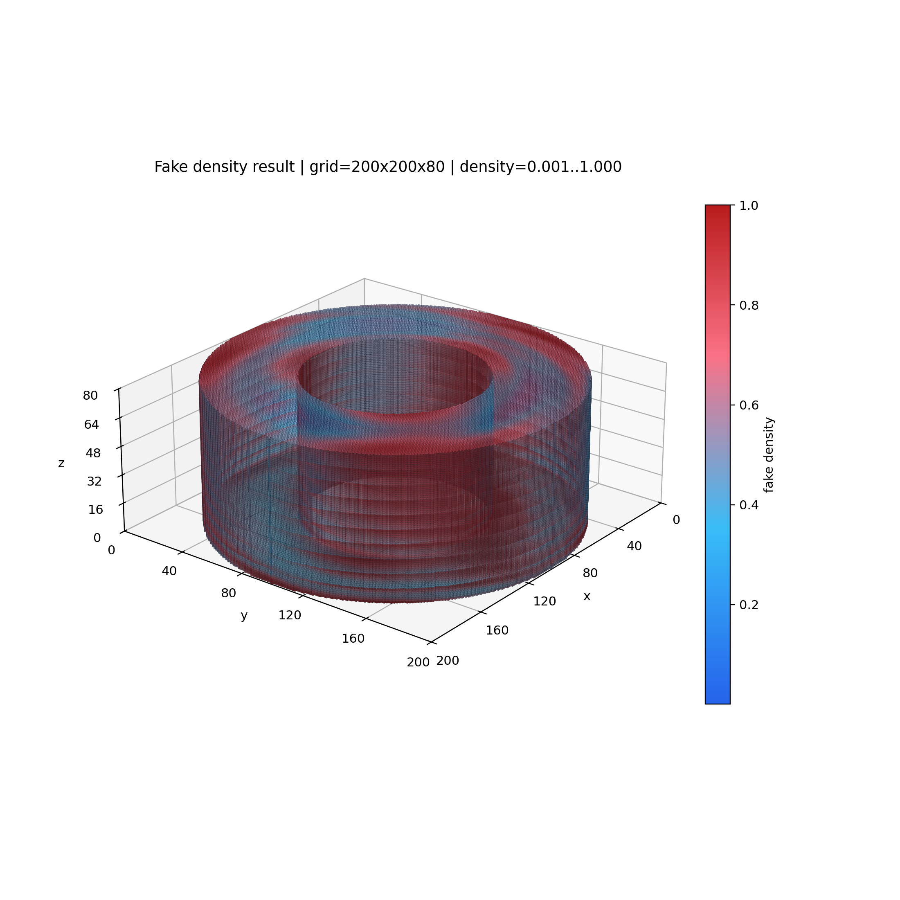

# Helix Voronoi + Topopt Sampling


一个围绕两条主线组织的 Python 项目：

- `helix_voronoi`：Voronoi 杆系几何生成、渲染、STL 导出、模量分析
- `topopt_sampling`：把拓扑优化三维密度场转成概率分布，并随机采样三维 seed points

---

## Packages

### 1) `helix_voronoi`

面向几何与分析，负责：

- Voronoi 单胞生成与边提取
- 直杆 / 螺旋杆实体化
- 预览图渲染
- STL 导出
- 基于 `SfePy` 的压缩模量分析

常用命令：

```bash
uv run helix-voronoi
uv run helix-voronoi export-helix --seed 55
uv run helix-voronoi export-mixed --seed 55
uv run helix-voronoi modulus --seed 55 --style both
```

补充预览图：


### 2) `topopt_sampling`

面向拓扑优化后处理，当前只保留一条干净链路：

```text
3D density field -> probability field -> random seed points
```

它负责：

- 读取 `.npz` 或 `.mat` 格式的三维密度输入
- 把密度场转换成采样概率
- 一次性从整个三维体素域中随机采样 `seed_points`
- 把结果保存为 `.npz`，用于后续几何流程

源码位置：

- `src/topopt_sampling/`

CLI：

```bash
uv run topopt-sampling sample-seeds \
  datasets/topopt/fake_density_annular_cylinder_200x200x80.npz \
  --num-seeds 2000 \
  --output-npz datasets/topopt/seed_probability_mapping_2000.npz
```

示意图：



---

## 数学思路

设拓扑优化输出为三维密度场 `rho(i,j,k)`。

1. 先把密度场转成权重：

```text
w(i,j,k) = rho(i,j,k)^gamma
```

2. 再做归一化，得到离散概率分布：

```text
p(i,j,k) = w(i,j,k) / sum(w)
```

3. 最后按这个离散分布采样 `num_seeds` 次，并在每个被选中的体素内部加入 `[0,1)` 随机扰动，得到连续坐标的种子点：

```text
seed = voxel_index + uniform_jitter
```

这套方法的重点是：

- 高密度区域更容易被采到
- 零密度区域不会产生种子
- 不再引入 template、回填、3x3 拼接之类的额外结构假设

---

## Demo Workflow

仓库默认不提交新的 `200x200x80` demo 输入数据，所以推荐先按下面顺序生成。

### A. 生成中空圆柱体素输入

```bash
uv run python experiments/voxel_demos/generate_voxel_torus_npz.py \
  --output datasets/voxel/voxel_annular_cylinder_200x200x80.npz \
  --xy-size 200 \
  --z-size 80 \
  --outer-radius 100 \
  --inner-radius 50
```

### B. 生成假的拓扑优化密度结果

```bash
uv run python experiments/topopt_sampling/generate_fake_density_result.py \
  datasets/voxel/voxel_annular_cylinder_200x200x80.npz \
  --output datasets/topopt/fake_density_annular_cylinder_200x200x80.npz
```

### C. 从密度场采样随机种子点

```bash
uv run topopt-sampling sample-seeds \
  datasets/topopt/fake_density_annular_cylinder_200x200x80.npz \
  --num-seeds 2000 \
  --output-npz datasets/topopt/seed_probability_mapping_2000.npz
```

### D. 生成总览图

```bash
uv run python experiments/topopt_sampling/render_sampling_pipeline_overview.py \
  --density-npz datasets/topopt/fake_density_annular_cylinder_200x200x80.npz \
  --seed-npz datasets/topopt/seed_probability_mapping_2000.npz \
  --output docs/assets/topopt_sampling_pipeline_overview.png
```

如果只想看 fake density 本身，也可以：

```bash
uv run python experiments/topopt_sampling/visualize_fake_density_result.py \
  datasets/topopt/fake_density_annular_cylinder_200x200x80.npz \
  --output docs/assets/fake_density_annular_cylinder_200x200x80.png
```

---

## Repo Layout

```text
src/
  helix_voronoi/      # 几何生成、渲染、STL、分析
  topopt_sampling/    # density -> probability -> random seeds 工作流

experiments/
  topopt_sampling/    # density / probability / seed 相关实验脚本
  voxel_demos/        # 体素 demo

datasets/
  topopt/             # 拓扑优化链路输入与中间结果
  voxel/              # 体素 demo 数据

docs/assets/          # 文档图片与展示产物
tests/                # 回归测试
```

---

## Testing

```bash
uv run python -m unittest discover -s tests -v
```

---

## Related Docs

- `docs/analysis/modulus-plan.md`
- `docs/voxel_torus_demo.md`
