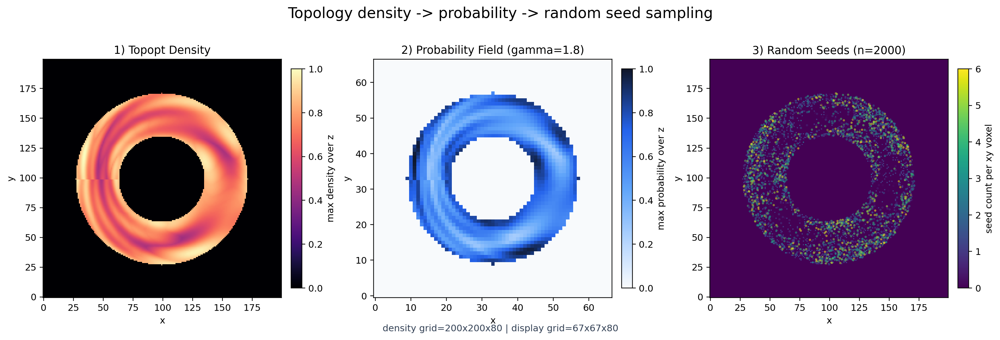
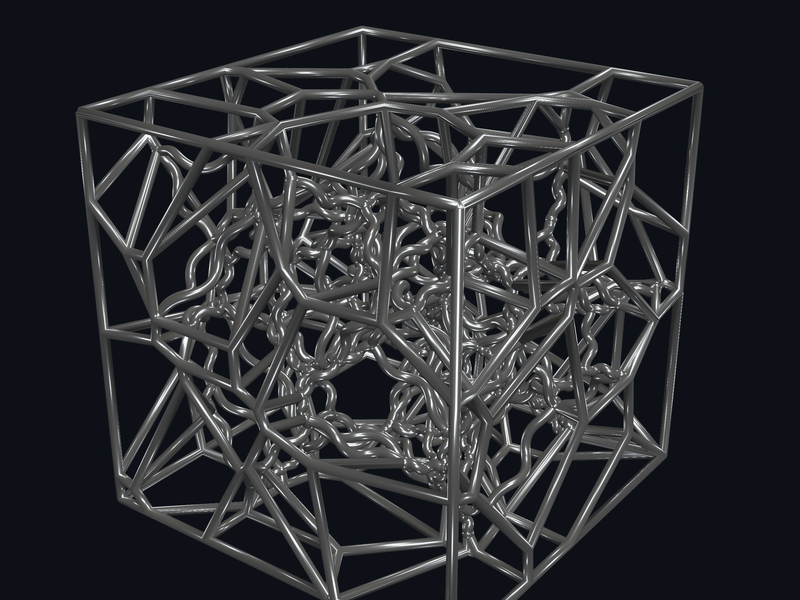

# Helix Voronoi + Topopt Sampling



一个围绕两条主线组织的 Python 项目：

- `helix_voronoi`：Voronoi 杆系几何生成、渲染、STL 导出
- `topopt_sampling`：把拓扑优化三维密度场转成概率分布，并随机采样三维 seed points

---

## Packages

### 1) `helix_voronoi`

面向几何生成与导出，负责：

- Voronoi 单胞生成与边提取
- 直杆 / 螺旋杆实体化
- 预览图渲染
- STL 导出
常用命令：

```bash
uv run helix-voronoi
uv run helix-voronoi export-helix --seed 55
uv run helix-voronoi export-mixed --seed 55
uv run helix-voronoi modulus --seed 55 --style both
uv run fem-analysis annular-cylinder --outer-diameter-cm 3 --inner-diameter-cm 2 --height-cm 2 --load-n 1000 --voxel-size-mm 0.4
uv run fem-analysis annular-cylinder --outer-diameter-cm 3 --inner-diameter-cm 2 --height-cm 2 --load-n 1000 --voxel-size-mm 0.4 --inner-fill bone --fill-youngs-modulus-gpa 1.0 --fill-poisson-ratio 0.3
uv run fem-analysis annular-cylinder --output-npz datasets/topopt/annular_cylinder_fea_density.npz
```

补充预览图：



### 2) `topopt_sampling`

面向拓扑优化后处理，当前只保留一条干净链路：

```text
3D density field -> probability field -> random seed points
```

它负责：

- 读取 `.npz` 或 `.mat` 格式的三维密度输入
- 把密度场转换成采样概率，默认 `gamma=1.0`
- 一次性从整个三维体素域中随机采样 `seed_points`
- 把结果保存为 `.npz`，用于后续几何流程
- 基于解析支撑面与 Voronoi 半空间，构建 exact restricted Voronoi 3D 架构骨架

统一 `.npz` 输入约定的最小字段如下：

- `density_milli`：`uint16` 三维密度场，范围 `0..1000`
- `voxels`：`uint8` 三维占据体素，`0/1`
- `xy_size`、`z_size`：体素尺寸
- `shape_name`、`result_type`：数据来源标识

`fem_analysis` 导出的 annular-cylinder `.npz` 已经遵守这套约定，并额外携带 `material_id`、`voxel_size_xyz_m`、`outer_radius`、`inner_radius` 等元数据，能直接喂给 `topopt_sampling sample-seeds`。

源码位置：

- `src/topopt_sampling/`

CLI：

```bash
uv run topopt-sampling sample-seeds \
  datasets/topopt/fake_density_annular_cylinder_200x200x80.npz \
  --num-seeds 2000 \
  --output-npz datasets/topopt/seed_probability_mapping_2000.npz
```

也可以直接使用 Matlab `.mat` 输入：

```bash
uv run topopt-sampling sample-seeds \
  datasets/topopt/example_fake_density_annular_cylinder_200x200x80.mat \
  --num-seeds 2000 \
  --output-npz datasets/topopt/seed_probability_mapping_from_mat_2000.npz
```

对于 exact restricted Voronoi 3D 架构，可以先输出一个解析摘要：

```bash
uv run topopt-sampling exact-summary \
  datasets/topopt/seed_probability_mapping_2000.npz \
  --xy-size 200 \
  --z-size 80 \
  --outer-radius 100 \
  --inner-radius 50
```

也可以直接生成 end-to-end 的 hybrid exact B-rep JSON 结果：

```bash
uv run topopt-sampling build-exact-brep \
  datasets/topopt/seed_probability_mapping_2000.npz \
  --xy-size 200 \
  --z-size 80 \
  --outer-radius 100 \
  --inner-radius 50 \
  --seed-ids 0 1 2 \
  --output-json docs/analysis/restricted_voronoi_brep.json
```

输出会显式包含：
- support surfaces
- exact faces with loop edge ids
- exact edges with analytic curve kinds (`line_segment`, `circle_arc`, `cylinder_plane_curve`)
- exact vertices with triple-support provenance

对于 shell blocks 的交互查看，可以直接导出 Three.js viewer 所需的 GLB：

```bash
uv run topopt-sampling export-threejs-shell-glb \
  datasets/topopt/seed_probability_mapping_2000.npz \
  --xy-size 200 \
  --z-size 80 \
  --outer-radius 100 \
  --inner-radius 50 \
  --output-json viewer/public/data/hybrid_exact_shell_2000.glb
```

再启动 viewer：

```bash
cd viewer
pnpm install
pnpm dev
```

默认地址：`http://127.0.0.1:5173/`

当前导出链路已经包含圆柱周期接缝处理：
- cylinder face 会自动选择更稳定的 seam atlas 再展开三角化
- shell GLB 导出会对共享 seam 边做 canonical snapping
- cylinder / plane / cap 交界会额外生成 seam strip，降低接缝裂缝与破面风险

---

## 数学思路

设拓扑优化输出为三维密度场 `rho(i,j,k)`。

1. 先把密度场转成权重：

```text
w(i,j,k) = rho(i,j,k)^gamma
```

当前默认 `gamma = 1.0`。

2. 再做归一化，得到离散概率分布：

```text
p(i,j,k) = w(i,j,k) / sum(w)
```

3. 最后按这个离散分布采样 `num_seeds` 次，并在每个被选中的体素内部加入 `[0,1)` 随机扰动，得到连续坐标的种子点：

```text
seed = voxel_index + uniform_jitter
```

这套方法的重点是：

- 高密度区域更容易被采到
- 零密度区域不会产生种子
- 整个流程只依赖密度场本身，不引入额外结构假设

---

## Demo Workflow

仓库默认不提交新的 `200x200x80` demo 输入数据，所以推荐直接走 `topopt-sampling` 的正式命令链。

### A. 生成中空圆柱体素输入

```bash
uv run topopt-sampling generate-voxels \
  --output datasets/voxel/voxel_annular_cylinder_200x200x80.npz \
  --xy-size 200 \
  --z-size 80 \
  --outer-radius 100 \
  --inner-radius 50
```

### B. 生成假的拓扑优化密度结果

```bash
uv run topopt-sampling generate-fake-density \
  datasets/voxel/voxel_annular_cylinder_200x200x80.npz \
  --output datasets/topopt/fake_density_annular_cylinder_200x200x80.npz
```

### C. 从密度场采样随机种子点

```bash
uv run topopt-sampling sample-seeds \
  datasets/topopt/fake_density_annular_cylinder_200x200x80.npz \
  --num-seeds 2000 \
  --output-npz datasets/topopt/seed_probability_mapping_2000.npz
```

如果要验证 `.mat` 输入：

```bash
uv run topopt-sampling sample-seeds \
  datasets/topopt/example_fake_density_annular_cylinder_200x200x80.mat \
  --num-seeds 2000 \
  --output-npz datasets/topopt/seed_probability_mapping_from_mat_2000.npz
```

### D. 生成总览图

总览图现在包含 4 个 panel：
- 1) 密度场
- 2) 概率场
- 3) 2000 个随机种子点
- 4) 连续中空圆柱边界上的 3D Voronoi 表面分块图

```bash
uv run topopt-sampling render-overview \
  --density-npz datasets/topopt/fake_density_annular_cylinder_200x200x80.npz \
  --seed-npz datasets/topopt/seed_probability_mapping_2000.npz \
  --output docs/assets/topopt_sampling_pipeline_overview.png
```

---

## Repo Layout

```text
src/
  helix_voronoi/      # 几何生成、渲染、STL 导出
  topopt_sampling/    # density/demo -> probability -> random seeds 工作流

datasets/
  topopt/             # 拓扑优化链路输入与中间结果
  voxel/              # 体素 demo 数据

docs/assets/          # 文档图片与展示产物
tests/                # 回归测试
```

---

## Testing

```bash
uv run python -m unittest discover -s tests -v
```

---

## Related Docs

- `docs/how_to_start.md`
- `docs/plan/restricted-voronoi-3d-blocks-plan.md`
- `docs/voxel_torus_demo.md`
