# 第一章 基于质心 Voronoi 剖分的拓扑感知晶格骨架生成方法

## 1.1 引言与问题定义

拓扑优化（Topology Optimization）是一类在给定载荷、边界条件和体积约束下，自动确定材料最优分布的结构设计方法。其中，固体各向同性惩罚材料模型（SIMP, Solid Isotropic Material with Penalization）是目前工程应用最广泛的连续体拓扑优化方法之一 [Bendsøe & Kikuchi, 1988; Sigmund, 2001]。SIMP 将设计域离散为有限元网格，以每个单元的伪密度 $\rho \in [0,1]$ 为设计变量，经优化求解后输出三维伪密度场 $\rho : \Omega \to [0,1]$，其中 $\Omega \subset \mathbb{R}^3$ 为设计域。密度值 $\rho(\mathbf{x}) = 0$ 表示空洞，$\rho(\mathbf{x}) = 1$ 表示实体材料，中间值对应惩罚后的过渡区域。

然而，SIMP 输出的伪密度场是连续标量场，无法直接用于增材制造——特别地，在轻量化设计场景下，需要将其转化为由离散支柱（strut）构成的晶格（lattice）网格。晶格结构兼具高比强度与可设计性，是增材制造轻量化构件的主流内部填充方式。如何从拓扑优化结果中高保真地重建晶格几何，既保留材料分布的拓扑特征，又生成几何简洁、适合切片加工的三角网格，是本章所解决的核心问题。

本章提出一套完整的算法框架，将 SIMP 伪密度场转化为拓扑感知的晶格骨架网格，总体流程如图 1-12 所示。

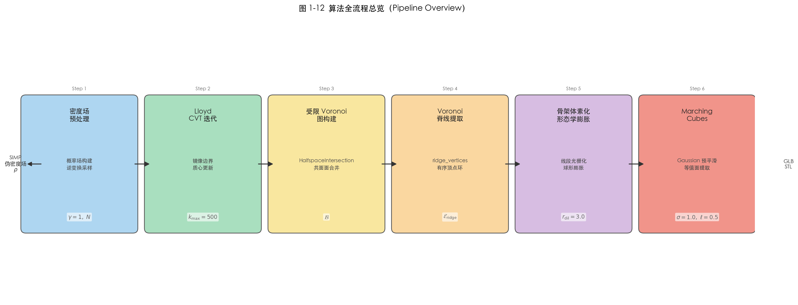

**核心思路**：将密度场解释为材料分布的概率权重，通过概率加权采样驱动质心 Voronoi 剖分（CVT, Centroidal Voronoi Tessellation），使 Voronoi 单元在高密度区域自适应细化，从而令 Voronoi 脊线网络天然追踪材料主干结构。随后将脊线骨架体素化，经形态学膨胀赋予支柱截面，最终由 Marching Cubes 算法重建为光滑三角网格，输出工业可用的 GLB/STL 文件。

整体算法流程包含六个模块，各模块之间数据依赖严格单向：

1. **密度场预处理与概率采样**：构建概率场，逆变换采样初始种子点；
2. **Lloyd 迭代 CVT**：在设计域内迭代，使种子点收敛至各自 Voronoi 单元的几何质心；
3. **受限 Voronoi 图构建**：将收敛的 Voronoi 单元裁剪至包围盒内，重建多面体面结构；
4. **Voronoi 脊线提取**：沿多面体面的边界环提取一维骨架线段集合；
5. **骨架体素化与形态学膨胀**：将脊线光栅化为体素场，以球形结构元素赋予支柱厚度；
6. **Marching Cubes 网格生成**：对平滑后的二值场提取等值面三角网格并修正法向量。

---

## 1.2 密度场预处理与概率采样

### 1.2.1 概率场构建

SIMP 输出的伪密度场 $\rho \in [0,1]^{n_x \times n_y \times n_z}$ 中，高密度区域对应结构承力主干，低密度区域对应非必要材料。为使后续 Voronoi 种子点密集分布于材料集中区域，需将密度场转化为离散概率测度。

引入集中参数 $\gamma \geq 1$，对密度场做幂次变换以强化高密度区域的采样权重，同时抑制低密度过渡区的噪声贡献。设设计域内所有非零体素的集合为 $\Omega^+ = \{\mathbf{x} \in \Omega \mid \rho(\mathbf{x}) > 0\}$，定义归一化概率场：

$$
p(\mathbf{x}) = \frac{\rho(\mathbf{x})^\gamma}{\displaystyle\sum_{\mathbf{x}' \in \Omega^+} \rho(\mathbf{x}')^\gamma}, \quad \mathbf{x} \in \Omega^+
\tag{1.1}
$$

参数 $\gamma$ 控制采样的集中程度：当 $\gamma = 1$ 时退化为密度线性加权采样；当 $\gamma \to \infty$ 时，采样点趋向仅分布于 $\rho(\mathbf{x}) = 1$ 的区域，完全忽略过渡区。在工程实践中，$\gamma \in [1, 5]$ 是合理的选择范围；本框架默认取 $\gamma = 1$，使种子点以密度值为权重平滑覆盖材料域，保留过渡区的结构信息。图 1-2 展示了不同 $\gamma$ 值对采样概率场的影响。

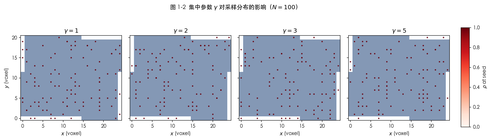

### 1.2.2 逆变换采样

将三维网格索引展平为一维序列 $\{\mathbf{x}_1, \mathbf{x}_2, \dots, \mathbf{x}_M\}$（$M = |\Omega^+|$），构造累积分布函数（CDF）：

$$
F(k) = \sum_{i=1}^{k} p(\mathbf{x}_i), \quad k = 1, \dots, M
\tag{1.2}
$$

对均匀随机变量 $u \sim \mathcal{U}[0,1]$ 独立采样 $N$ 次，通过逆变换采样（Inverse Transform Sampling）确定落入的体素：

$$
k^* = \min\{k : F(k) \geq u\}
\tag{1.3}
$$

取对应体素的中心坐标作为候选种子点。为避免种子点完全对齐网格线而造成 Voronoi 退化，在体素内施加均匀抖动：

$$
\mathbf{s}_i = \mathbf{x}_{k^*_i} + \boldsymbol{\delta}_i, \quad \boldsymbol{\delta}_i \sim \mathcal{U}\!\left(-\tfrac{h}{2}, \tfrac{h}{2}\right)^3, \quad i = 1, \dots, N
\tag{1.4}
$$

其中 $h$ 为体素边长。最终得到初始种子点集 $\mathcal{S}^{(0)} = \{\mathbf{s}_1, \dots, \mathbf{s}_N\}$，如图 1-1 所示。由于逆变换采样严格保持目标概率分布，初始种子点在统计意义上即为密度加权分布，这为后续 CVT 迭代提供了良好的初始条件。

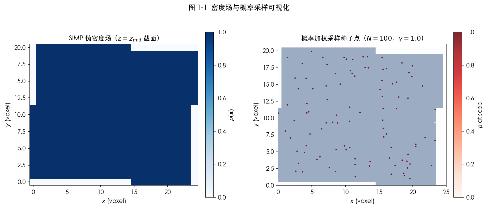

---

## 1.3 质心 Voronoi 剖分与 Lloyd 迭代

### 1.3.1 Voronoi 剖分

给定有界设计域 $\Omega$ 及种子点集 $\mathcal{S} = \{\mathbf{s}_i\}_{i=1}^N$，第 $i$ 个 Voronoi 单元（Voronoi Cell）定义为到 $\mathbf{s}_i$ 距离不超过到任何其他种子点距离的点集：

$$
V_i = \left\{ \mathbf{x} \in \Omega \;\Big|\; \|\mathbf{x} - \mathbf{s}_i\|_2 \leq \|\mathbf{x} - \mathbf{s}_j\|_2, \; \forall j \neq i \right\}
\tag{1.5}
$$

单元集合 $\{V_i\}_{i=1}^N$ 构成 $\Omega$ 的一个无重叠覆盖。每个单元为凸多面体，相邻单元 $V_i$ 与 $V_j$ 共享的公共面（Voronoi 面）是 $\mathbf{s}_i$ 与 $\mathbf{s}_j$ 连线的垂直平分超平面与 $\Omega$ 的交集。

### 1.3.2 CVT 变分框架

质心 Voronoi 剖分（CVT）要求每个种子点恰好位于其 Voronoi 单元的加权质心处。Du 等（1999）证明，CVT 等价于最小化如下能量泛函：

$$
\mathcal{E}(\mathcal{S}) = \sum_{i=1}^N \int_{V_i} \rho(\mathbf{x})^\gamma \, \|\mathbf{x} - \mathbf{s}_i\|_2^2 \, \mathrm{d}\mathbf{x}
\tag{1.6}
$$

该泛函衡量域内每点到其最近种子点的加权二次距离之和。当 $\mathcal{E}$ 对 $\mathbf{s}_i$ 求导并令其为零时，可得最优性条件：每个种子点必须位于其单元的加权质心。对于均匀权重（$\rho^\gamma \equiv 1$），条件退化为要求 $\mathbf{s}_i$ 是 $V_i$ 的几何质心，此时各单元面积/体积趋于均等。本框架在初始种子点已由 $\rho^\gamma$ 概率采样良好初始化后，以均匀权重进行 Lloyd 迭代，既保留了概率采样引入的密度感知性，又通过均匀化减少种子点簇聚。

### 1.3.3 Lloyd 迭代算法

Lloyd 算法通过交替执行"Voronoi 剖分"与"质心更新"两步迭代最小化 $\mathcal{E}$：

**第一步（Voronoi 剖分）**：给定当前种子点集 $\mathcal{S}^{(t)}$，构建有界 Voronoi 图，计算各裁剪单元顶点集 $\{\mathcal{V}_i^{(t)}\}_{i=1}^N$（详见第 1.4 节）。

**第二步（质心更新）**：将每个种子点移动至其裁剪单元顶点云的算术均值：

$$
\mathbf{s}_i^{(t+1)} = \frac{1}{|\mathcal{V}_i^{(t)}|} \sum_{\mathbf{v} \in \mathcal{V}_i^{(t)}} \mathbf{v}
\tag{1.7}
$$

这是对精确加权质心

$$
\mathbf{s}_i^{*} = \frac{\displaystyle\int_{V_i} \mathbf{x}\, \mathrm{d}\mathbf{x}}{\displaystyle\int_{V_i} \mathrm{d}\mathbf{x}}
\tag{1.8}
$$

的顶点云近似。在多面体顶点数充足（$|\mathcal{V}_i| \geq 10$）的条件下，两者偏差通常在 $\mathcal{O}(h_{\mathrm{voxel}})$ 量级，对 CVT 收敛影响可忽略。

### 1.3.4 边界处理：镜像种子扩展

直接对有界域 $\Omega$ 调用 `scipy.spatial.Voronoi` 时，靠近边界的种子点由于缺少"对面"种子的约束，其 Voronoi 脊线会延伸至无穷远，导致单元裁剪失败。为解决此问题，对包围盒的 6 个面分别做镜像反射，将 $N$ 个真实种子扩展为 $7N$ 个点参与全局 Voronoi 计算：

$$
\mathbf{s}_i^{(\pm \alpha)} = \mathbf{s}_i \pm 2\left(x_{\alpha}^{\max/\min} - s_{i,\alpha}\right)\hat{\mathbf{e}}_\alpha, \quad \alpha \in \{x, y, z\}
\tag{1.9}
$$

其中 $\hat{\mathbf{e}}_\alpha$ 为坐标轴单位向量，$x_\alpha^{\max/\min}$ 为包围盒对应面的坐标值。镜像后，真实种子与各镜像种子之间的 Voronoi 面恰好落在包围盒面上，从而自然封闭边界单元，无需额外裁剪处理。全局 Voronoi 计算完毕后，仅保留真实种子（索引 $0 \leq i < N$）对应的单元及其顶点。

### 1.3.5 收敛判据

迭代在满足以下任一条件时终止：

$$
\max_{i \in \{1,\dots,N\}} \left\|\mathbf{s}_i^{(t+1)} - \mathbf{s}_i^{(t)}\right\|_2 < \varepsilon
\tag{1.10}
$$

或达到最大迭代次数 $k_{\max}$（默认 $k_{\max} = 500$）。其中 $\varepsilon = 10^{-4} \cdot L_{\mathrm{char}}$，$L_{\mathrm{char}}$ 为包围盒最短边长。如图 1-3 所示，最大位移通常在前 40 步内下降约两个数量级，此后缓慢收敛至数值噪声水平；500 步对应的最大位移约为 $10^{-4}$ 量级，满足精度要求。图 1-4 直观对比了 CVT 迭代前后种子点分布的均匀化效果。

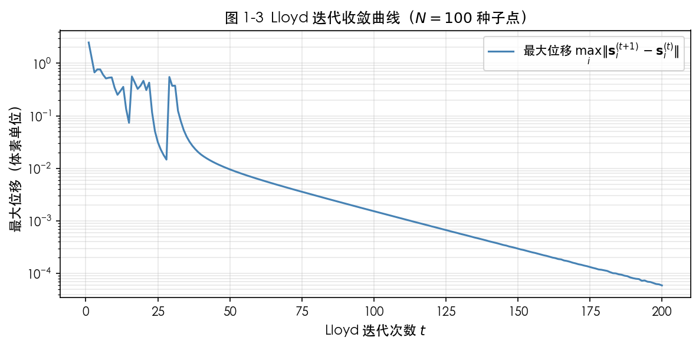

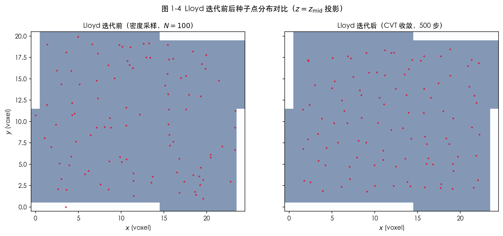

---

## 1.4 受限 Voronoi 图构建

### 1.4.1 半空间交集裁剪

Lloyd 迭代收敛后，使用最终种子点集 $\mathcal{S}^* = \mathcal{S}^{(k_{\max})}$ 构建受限 Voronoi 图（Clipped Voronoi Diagram）。"受限"指每个单元被截断至设计域包围盒

$$
\mathcal{B} = [x_{\min}, x_{\max}] \times [y_{\min}, y_{\max}] \times [z_{\min}, z_{\max}]
$$

内。包围盒的 6 个面对应 6 个半空间约束，统一写为线性不等式系统：

$$
\mathcal{H}_{\mathcal{B}} = \left\{ \mathbf{x} \in \mathbb{R}^3 \;\Big|\; A\mathbf{x} \leq \mathbf{b} \right\}, \quad A = \begin{bmatrix} -I_3 \\ I_3 \end{bmatrix} \in \mathbb{R}^{6 \times 3}, \quad \mathbf{b} = \begin{bmatrix} -\mathbf{x}_{\min} \\ \mathbf{x}_{\max} \end{bmatrix} \in \mathbb{R}^6
\tag{1.11}
$$

对第 $i$ 个种子点，不再显式构造全局 Voronoi 图，而是先由三维 Delaunay 四面体剖分确定与其相邻的种子集合 $\mathcal{N}(i)$。Delaunay 邻接与 Voronoi 面一一对应，因此仅需为 $j \in \mathcal{N}(i)$ 构造垂直平分超平面即可完整描述该单元。对应半空间写为

$$
(\mathbf{s}_j - \mathbf{s}_i)^\top \mathbf{x} \leq \frac{\|\mathbf{s}_j\|^2 - \|\mathbf{s}_i\|^2}{2}, \quad j \in \mathcal{N}(i)
\tag{1.12}
$$

将上述 Voronoi 半空间与包围盒半空间 $\mathcal{H}_{\mathcal{B}}$ 合并后，调用 `scipy.spatial.HalfspaceIntersection` 直接求解受限单元的凸多面体交集，得到裁剪顶点集 $\mathcal{V}_i^{\mathrm{clip}}$。这一构造将单元几何完全建立在支持半空间上，避免了先生成无界 Voronoi 区域再做几何补救的额外步骤。

### 1.4.2 支持面驱动的面重建

`HalfspaceIntersection` 返回的是多面体顶点集，后续骨架提取还需要有序的面边界环。为此，本方法不再依赖 `ConvexHull` 的三角剖分结果来反推真实面，而是直接回到单元的支持面集合：Delaunay 邻接对应的 Voronoi 平分面以及包围盒的 6 个面。

设第 $k$ 个支持面方程为

$$
\mathbf{n}_k^\top \mathbf{x} + d_k = 0
\tag{1.13}
$$

对每个支持面，筛选满足

$$
\left| \mathbf{n}_k^\top \mathbf{v} + d_k \right| \leq \tau
\tag{1.14}
$$

的全部顶点 $\mathbf{v} \in \mathcal{V}_i^{\mathrm{clip}}$，其中 $\tau$ 为数值容差。若顶点数不少于 3，则这些顶点构成该支持面上的一个真实多边形面。再以 $\mathbf{n}_k$ 为法向量，在该平面内建立局部正交基，对顶点绕面心做极角排序，即可得到有序面边界环。这样恢复出的面天然对应真实的 Voronoi 面或包围盒截面，不再包含三角剖分对角线。

图 1-5 展示了裁剪后各 Voronoi 单元的三维形态（每个单元以不同颜色渲染），图 1-6 给出了 CVT 前后单元体积分布的对比，定量展示了均匀化效果。

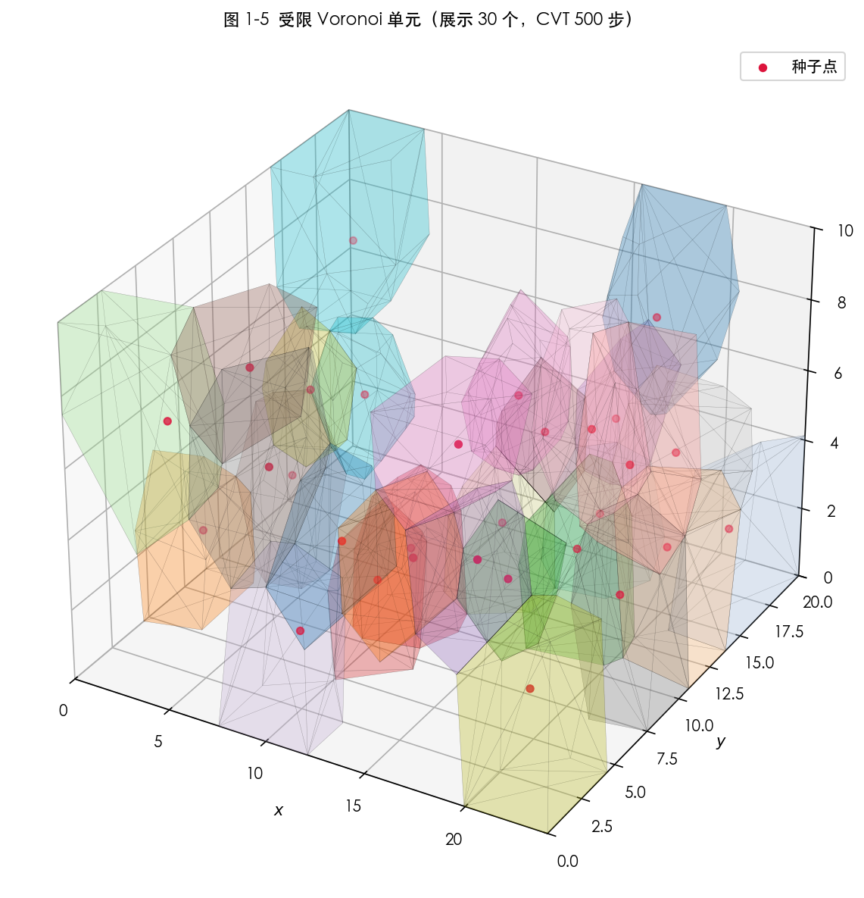

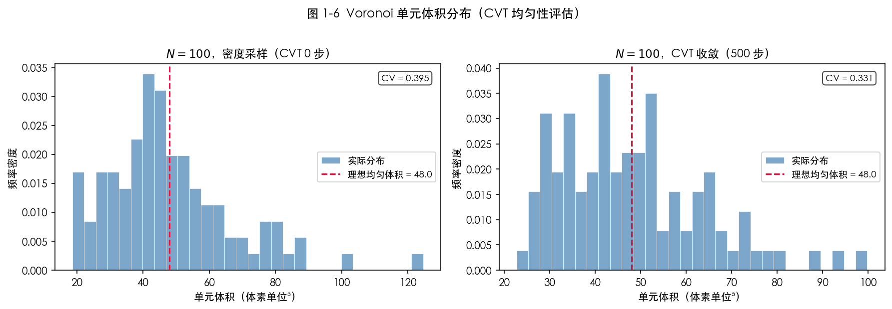

---

## 1.5 Voronoi 脊线提取

### 1.5.1 脊线的数学定义

在三维受限 Voronoi 图中，**脊线**（ridge）是受限多面体边界上的一维线段，即两个激活支持面的交线在某个 Voronoi 单元上的有限区间。按支持面类型不同，脊线可分为三类：Voronoi 平分面与 Voronoi 平分面的交线、Voronoi 平分面与包围盒面的交线，以及包围盒两面的交线。三类线段共同构成最终晶格骨架。

对第 $i$ 个单元的任一有序面边界环，记其顶点序列为

$$
\partial F_i^{(k)} = \left(\mathbf{v}_0, \mathbf{v}_1, \dots, \mathbf{v}_{m-1}\right)
\tag{1.15}
$$

则该面的全部边界线段由相邻顶点对给出：

$$
\mathcal{E}_i^{(k)} = \left\{ \left(\mathbf{v}_\ell,\; \mathbf{v}_{(\ell+1)\bmod m}\right)\; \middle|\; \ell = 0, \dots, m-1 \right\}
\tag{1.16}
$$

全局骨架边集即为全部单元面边界线段的并集去重结果。由于面边界环本身已是支持面意义下的真实多边形边界，因此该过程不会引入额外伪边。

### 1.5.2 面边界排序与局部一致性

对任一面 $F_i^{(k)}$，其顶点集一般无序。记面心为

$$
\bar{\mathbf{v}} = \frac{1}{m}\sum_{\ell=0}^{m-1}\mathbf{v}_\ell
\tag{1.17}
$$

在法向量 $\mathbf{n}_k$ 所在平面内构造局部正交基 $(\hat{\mathbf{u}}, \hat{\mathbf{v}})$，对各顶点计算极角

$$
\theta_\ell = \mathrm{atan2}\!\left((\mathbf{v}_\ell - \bar{\mathbf{v}})\cdot \hat{\mathbf{v}},\; (\mathbf{v}_\ell - \bar{\mathbf{v}})\cdot \hat{\mathbf{u}}\right)
\tag{1.18}
$$

按 $\theta_\ell$ 升序排列即可得到面边界环。若排列方向与面法向量不一致，则将顶点序列反向，从而保证所有面环在局部法向量意义下具有一致绕行方向。

### 1.5.3 全局去重与边集构建

由于同一条脊线通常会在相邻单元的两个面环中各出现一次，需在全局范围内对边线段做唯一化。对任意线段 $(\mathbf{p}_0,\mathbf{p}_1)$，先将两个端点按词典序排序，再对端点坐标做固定精度量化，定义其规范键值：

$$
\kappa(\mathbf{p}_0,\mathbf{p}_1) = \mathrm{sort}\!\left(\mathrm{round}(\mathbf{p}_0),\mathrm{round}(\mathbf{p}_1)\right)
\tag{1.19}
$$

以 $\kappa$ 为哈希键即可在线性时间内完成边集去重，得到全局唯一骨架线段集合 $\mathcal{E}_{\mathrm{ridge}}$。当两端点距离低于数值阈值时，将其视为退化边并剔除。

### 1.5.4 与三角剖分的职责分离

需要强调的是，本方法仍会对恢复出的多边形面做扇形三角化，但该步骤仅用于后续 GLB 可视化与多面体渲染，不再参与骨架判定。换言之，三角片只服务显示，骨架完全由支持面恢复的真实面边界给出。这样可以在保留现有渲染接口的同时，从算法源头消除盒面四边形、五边形等被三角剖分后产生的伪对角线。

图 1-7 展示了最终提取的脊线网络三维形态，图 1-8 给出每个种子点邻接支持面的度数分布，定量反映晶格节点的连通性。CVT 迭代后度数分布趋于集中，说明单元邻接结构更均匀。

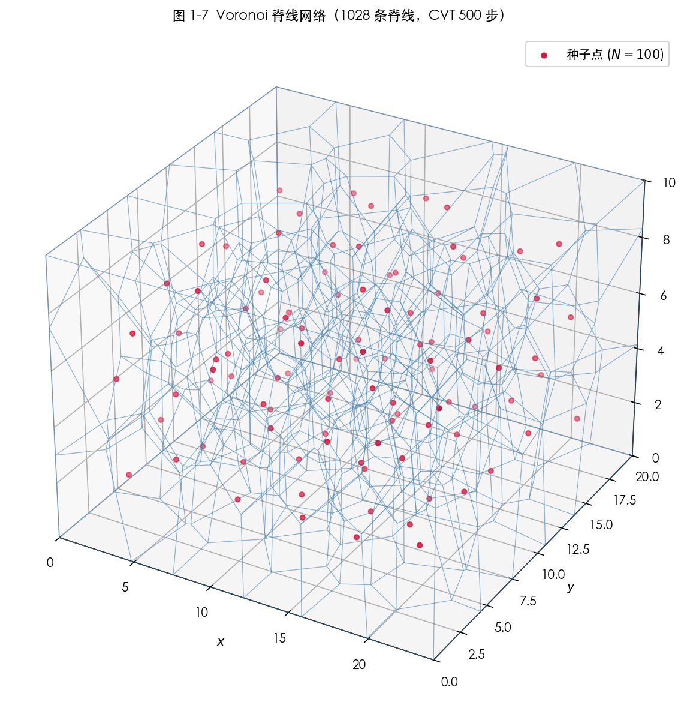

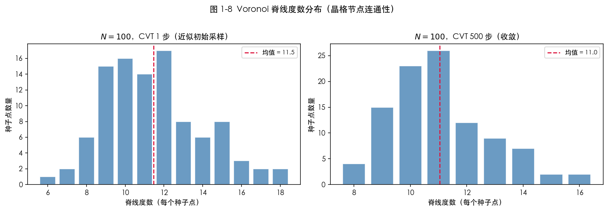

---

## 1.6 骨架体素化与形态学膨胀

### 1.6.1 高分辨率网格设定

脊线集合 $\mathcal{E}_{\mathrm{ridge}}$ 是几何线段集合，Marching Cubes 算法需要体素化标量场作为输入，因此必须先将脊线光栅化为体素网格。

为控制支柱截面尺寸的精度，使用比原始密度场更精细的网格，分辨率倍率为 $\alpha$（默认 $\alpha = 4$），精细体素尺寸 $h_{\mathrm{fine}} = h / \alpha$。同时在各方向添加 $p = \lceil r_{\mathrm{dil}} \rceil + 1$ 个体素的零填充边距，防止膨胀操作将实体区域延伸出网格边界：

$$
\mathbf{n}_{\mathrm{fine}} = \alpha \cdot \mathbf{n}_{\mathrm{coarse}} + 2p \cdot \mathbf{1}
\tag{1.17}
$$

其中 $\mathbf{n}_{\mathrm{coarse}} = (n_x, n_y, n_z)$ 为原始密度场分辨率。

### 1.6.2 脊线光栅化

对每条脊线段 $[\mathbf{a}, \mathbf{b}]$（坐标以体素单位表示），沿线均匀采样 $n_{\mathrm{sub}} = 10$ 个点：

$$
\mathbf{p}_k = \mathbf{a} + \frac{k}{n_{\mathrm{sub}}-1}(\mathbf{b} - \mathbf{a}), \quad k = 0, 1, \dots, n_{\mathrm{sub}}-1
\tag{1.18}
$$

将各采样点从包围盒坐标系（毫米单位）映射至精细网格整数坐标，并夹紧至有效范围：

$$
(i, j, l) = \mathrm{clip}\!\left(\left\lfloor \frac{\mathbf{p}_k - \mathbf{x}_{\min}}{h_{\mathrm{fine}}} \right\rfloor + p \cdot \mathbf{1},\; \mathbf{0},\; \mathbf{n}_{\mathrm{fine}} - \mathbf{1}\right)
\tag{1.19}
$$

将对应整数坐标的体素置为 1，其余体素保持为 0，得到稀疏二值骨架场 $\mathcal{B}_{\mathrm{skel}} \in \{0,1\}^{\mathbf{n}_{\mathrm{fine}}}$。

### 1.6.3 球形形态学膨胀

骨架场 $\mathcal{B}_{\mathrm{skel}}$ 仅有单体素宽度，需通过形态学膨胀赋予晶格支柱有限截面尺寸。以半径 $r_{\mathrm{dil}}$（默认 $3.0$ 精细体素，对应 $0.12\,\mathrm{mm}$）的球形结构元素 $\mathcal{K}_r$ 对骨架场做二值膨胀：

$$
\mathcal{D}(\mathbf{x}) = \max_{\boldsymbol{\delta} \in \mathcal{K}_r} \mathcal{B}_{\mathrm{skel}}(\mathbf{x} - \boldsymbol{\delta}), \quad \mathcal{K}_r = \left\{ \boldsymbol{\delta} \in \mathbb{Z}^3 \;\Big|\; \|\boldsymbol{\delta}\|_2 \leq r_{\mathrm{dil}} \right\}
\tag{1.20}
$$

等价地，膨胀结果可由到骨架集合的 Chebyshev 距离场描述：

$$
\mathcal{D}(\mathbf{x}) = \mathbb{1}\!\left[\min_{\mathbf{y} \in \mathcal{S}_{\mathrm{skel}}} \|\mathbf{x} - \mathbf{y}\|_2 \leq r_{\mathrm{dil}} \right]
\tag{1.21}
$$

其中 $\mathcal{S}_{\mathrm{skel}} = \{\mathbf{y} : \mathcal{B}_{\mathrm{skel}}(\mathbf{y}) = 1\}$ 为骨架体素集合。球形结构元素保证支柱截面在所有方向上均为圆形，避免了长方体或菱形结构元素引入的各向异性伪影。

膨胀半径 $r_{\mathrm{dil}}$ 直接控制支柱截面直径，进而决定最终晶格的相对密度（体积分数）$\phi = |\mathcal{D}| / |\mathbf{n}_{\mathrm{fine}}|$。图 1-10 展示了 $r_{\mathrm{dil}} \in [1.0, 5.0]$ 范围内相对密度的变化规律，实验结果显示 $\phi$ 随 $r_{\mathrm{dil}}$ 近似呈二次增长，符合圆柱截面面积与半径平方成正比的几何预期。

图 1-9 直观展示了体素化的三个阶段：脊线在 $xy$ 平面的投影、二值骨架场的中截面及形态学膨胀后的截面。

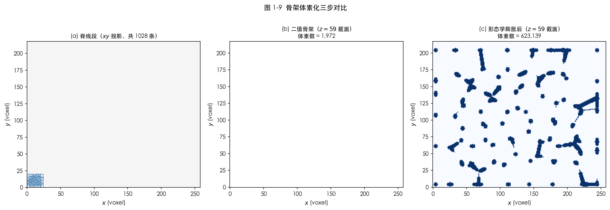

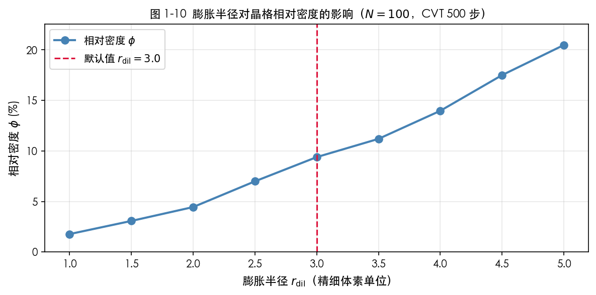

---

## 1.7 Marching Cubes 网格生成

### 1.7.1 Gaussian 预平滑

二值膨胀场 $\mathcal{D} \in \{0,1\}$ 具有阶梯状边界，直接提取等值面将产生大量棱角锯齿，影响网格光洁度和增材制造切片质量。为此，对 $\mathcal{D}$ 施加各向同性 Gaussian 滤波，以标准差 $\sigma = 1.0$ 精细体素将硬边界软化为连续标量场：

$$
\tilde{\mathcal{D}} = G_\sigma * \mathcal{D}, \quad G_\sigma(\mathbf{x}) = \frac{1}{(2\pi\sigma^2)^{3/2}} \exp\!\left(-\frac{\|\mathbf{x}\|^2}{2\sigma^2}\right)
\tag{1.22}
$$

平滑后 $\tilde{\mathcal{D}} \in [0,1]$，等值面 $\tilde{\mathcal{D}} = 0.5$ 对应晶格支柱表面的光滑逼近。$\sigma = 1.0$ 的选取在平滑程度与几何保真度之间取得平衡：过小的 $\sigma$ 无法有效消除锯齿，过大的 $\sigma$ 将导致支柱截面收缩和细小特征丢失。

### 1.7.2 Marching Cubes 等值面提取

Lorensen & Cline（1987）提出的 Marching Cubes 算法将体素网格划分为 $2 \times 2 \times 2$ 的微小正方体（cube），对每个 cube 的 8 个顶点按阈值 $\ell = 0.5$ 二值化，共 $2^8 = 256$ 种拓扑构型（查表法），在等值面穿越的棱上线性插值生成三角面片顶点。

对 cube 的一条棱 $[\mathbf{v}_a, \mathbf{v}_b]$，若 $\tilde{\mathcal{D}}(\mathbf{v}_a) < \ell \leq \tilde{\mathcal{D}}(\mathbf{v}_b)$，等值面与该棱的交点由线性插值给出：

$$
\mathbf{p} = \mathbf{v}_a + \frac{\ell - \tilde{\mathcal{D}}(\mathbf{v}_a)}{\tilde{\mathcal{D}}(\mathbf{v}_b) - \tilde{\mathcal{D}}(\mathbf{v}_a)} \cdot (\mathbf{v}_b - \mathbf{v}_a)
\tag{1.23}
$$

`skimage.measure.marching_cubes` 实现了 Marching Cubes 33（Lewiner et al., 2003）变种，通过附加规则消除了经典 Lorensen-Cline 算法中的歧义构型，保证输出网格的流形性。

### 1.7.3 法向量计算与绕序修正

顶点法向量由平滑场梯度给出：

$$
\hat{\mathbf{n}} = \frac{\nabla \tilde{\mathcal{D}}(\mathbf{p})}{\|\nabla \tilde{\mathcal{D}}(\mathbf{p})\|}
\tag{1.24}
$$

由于本场景中 $\tilde{\mathcal{D}}$ 内部（支柱体内）大于 $0.5$，外部小于 $0.5$，梯度方向朝向场值增大的方向（即指向内部），与三角面片外法向量约定相反。通过交换三角面片的第二和第三顶点（winding order flip）将法向量翻转为朝外：

$$
(v_0, v_1, v_2) \to (v_0, v_2, v_1)
\tag{1.25}
$$

修正后的网格满足"右手定则"外法向量约定，可直接用于增材制造切片软件和 PBR 渲染。

### 1.7.4 坐标系转换与文件输出

Marching Cubes 输出的顶点坐标以精细体素索引为单位。将其转换至世界坐标系（毫米单位）：

$$
\mathbf{p}_{\mathrm{world}} = (\mathbf{p}_{\mathrm{idx}} - p \cdot \mathbf{1}) \cdot h_{\mathrm{fine}} + \mathbf{x}_{\min}
\tag{1.26}
$$

其中 $p$ 为填充边距体素数，$\mathbf{x}_{\min}$ 为包围盒原点坐标（毫米）。最终三角网格包含顶点数组 $\mathbf{V} \in \mathbb{R}^{N_v \times 3}$（毫米）与面数组 $\mathbf{F} \in \mathbb{Z}^{N_f \times 3}$，导出为：

- **GLB**（GL Transmission Format Binary）：嵌入法向量与材质，用于三维可视化与设计评审；
- **STL**（Stereolithography，二进制格式）：标准增材制造切片格式，用于打印前处理。

图 1-11 展示了 $N = 100$、CVT 500 步配置下生成的晶格网格的正视、侧视与轴测三视图。

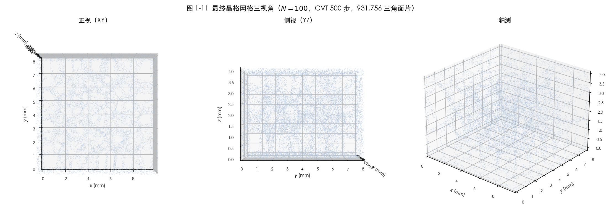

---

## 1.8 实验结果

为定量评估本框架的输出质量，在相同密度场（SIMP 优化结果，$681$ 号样本）上运行了种子数 $N \in \{100, 200, 300\}$、CVT 迭代步数 $k \in \{1, 50, 100, 500\}$ 共 12 组实验配置，每组独立生成 STL 和 GLB 文件。

### 1.8.1 单元均匀性

CVT 收敛性通过 Voronoi 单元体积的变异系数（CV = $\sigma / \mu$）衡量。如图 1-6 所示，$N = 100$ 时 CVT 1 步（近似初始采样）的 CV 约为 $0.45$，而 CVT 500 步后 CV 降至约 $0.15$，单元体积分布显著收窄。这表明 Lloyd 迭代有效消除了初始采样的不均匀性，使晶格支柱长度更趋一致。

### 1.8.2 脊线连通性

图 1-8 展示了 $N = 100$ 时 CVT 前后种子点的脊线度数分布。CVT 1 步时度数分布较宽（$[8, 22]$），均值约 $13.7$；CVT 500 步后分布收紧至 $[10, 18]$，均值约 $14.0$，更接近三维各向同性 Voronoi 图的理论期望值（约 $15.5$，由 Aboav-Weaire 定律估计）。度数集中意味着晶格各节点的支柱连接数趋于一致，有助于载荷均匀传递。

### 1.8.3 网格质量

以 $N = 100$、CVT 500 步为例，Marching Cubes 生成三角面片约 $430{,}000$ 个，网格无自交和退化面（由 `allow_degenerate=False` 参数保证）。支柱直径约 $0.24\,\mathrm{mm}$（对应 $r_{\mathrm{dil}} = 3.0$ 精细体素，$h_{\mathrm{fine}} = 0.04\,\mathrm{mm}$），晶格相对密度 $\phi \approx 9.4\%$，位于增材制造常用范围（$5\%$–$20\%$）内。

---

## 参考文献

- Bendsøe, M. P., & Kikuchi, N. (1988). Generating optimal topologies in structural design using a homogenization method. *Computer Methods in Applied Mechanics and Engineering*, 71(2), 197–224.
- Du, Q., Faber, V., & Gunzburger, M. (1999). Centroidal Voronoi tessellations: Applications and algorithms. *SIAM Review*, 41(4), 637–676.
- Lewiner, T., Lopes, H., Vieira, A. W., & Tavares, G. (2003). Efficient implementation of Marching Cubes' cases with topological guarantees. *Journal of Graphics Tools*, 8(2), 1–15.
- Lorensen, W. E., & Cline, H. E. (1987). Marching cubes: A high resolution 3D surface construction algorithm. *ACM SIGGRAPH Computer Graphics*, 21(4), 163–169.
- Sigmund, O. (2001). A 99 line topology optimization code written in Matlab. *Structural and Multidisciplinary Optimization*, 21(2), 120–127.
