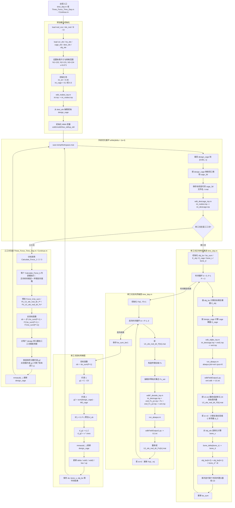
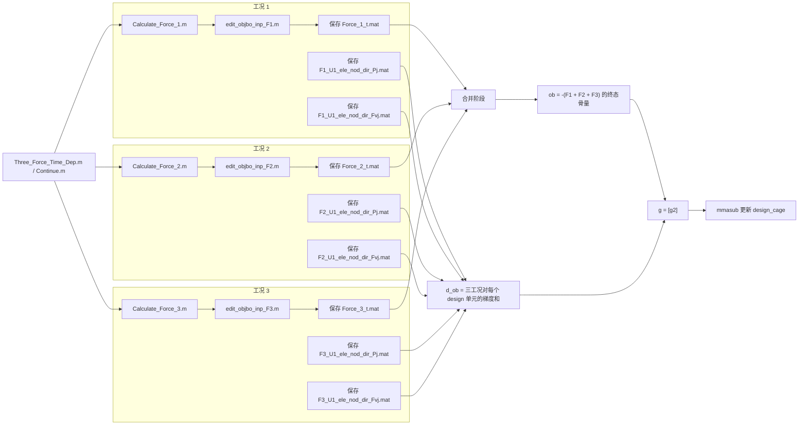

# FJW Work Algorithm Notes

这份文档只做一件事：把 `references/fjw_work/` 里的 MATLAB + Abaqus 工作流拆开讲清楚。

重点是把下面这些事情讲清楚：

- 主控脚本怎么跑
- 每一步输入输出是什么
- 中间文件怎么传
- 优化目标、约束、灵敏度链路怎么闭环

我这里的结论完全基于 `references/fjw_work/` 里的脚本和数据文件。部分中文注释有编码问题，因此个别医学/区域命名存在少量推断；凡是推断出来的地方，我都会明确说。

## 1. 总结先行

方嘉纬学长这套工作是一条 **时变骨改建驱动的 cage 优化流程**。

它的核心闭环是：

1. 用 MATLAB 保存和更新设计变量 `design_cage`
2. 把当前设计写进 Abaqus 的 `.inp`
3. 在 Abaqus 里算位移场
4. 回读位移场，计算骨刺激 `bone_s`
5. 用 `bone_delta` 更新目标骨区的骨量 `obj_bo`
6. 用伴随/反向灵敏度链路把目标函数对 `design_cage` 的导数算出来
7. 用 MMA 更新 `design_cage`
8. 重复迭代直到收敛

单工况版本的主控脚本是：

- `references/fjw_work/time_dep.m`

三工况版本的主控脚本是：

- `references/fjw_work/Three_Force_Time_Dep.m`
- `references/fjw_work/Continue.m`

其中 `Continue.m` 基本就是三工况主循环本体，用来断点继续跑。

## 2. 核心文件和角色

### 2.1 主控与优化

- `time_dep.m`
  - 单工况版本
  - 外层优化循环 + 内层时间推进 + 伴随灵敏度 + MMA 更新
- `Three_Force_Time_Dep.m`
  - 三个受力方向的版本
  - 通过 `Calculate_Force_1/2/3.m` 分别计算三套载荷，再合并目标函数与梯度
- `Continue.m`
  - 与三工况主循环同构，应该是中断后继续算的版本
- `mmasub.m`
  - MMA 优化器
- `subsolv.m`
  - MMA 子问题求解器

### 2.2 正向工况求解

- `Calculate_Force_1.m`
- `Calculate_Force_2.m`
- `Calculate_Force_3.m`

这三个脚本结构几乎一样，差异主要在：

- 拼接的工况尾文件不同
- 生成的结果文件名前缀不同

### 2.3 Abaqus 输入文件生成

- `edit_nodesi_inp.m`
  - 从节点、单元、骨分区数据生成基础几何模型
- `edit_desicage_inp.m`
  - 把设计区 `desi_ele` 和当前 `design_cage` 分桶后写入
- `edit_objbo_inp.m`
  - 单工况正向求解的材料分组和 `.inp` 拼接
- `edit_objbo_inp_F1.m`
- `edit_objbo_inp_F2.m`
- `edit_objbo_inp_F3.m`
  - 三工况正向求解版本
- `editF_desiele_inp.m`
  - 伴随/虚载荷求解版本，会把 `Fv` 作为结点集中力写进 `.inp`

### 2.4 Abaqus 调度与结果回读

- `run_abaqus.m`
  - 启动 `abaqus job=vert cpus=8`
  - 轮询 `vert.lck`，直到作业结束
- `odbFieldOutput1.py`
  - 从 `vert.odb` 的 `Load` 步最后一帧提取位移场 `U`
  - 写入 `U1.txt`

### 2.5 骨改建模型

- `bone_delta.m`
  - 输入机械刺激 `s`
  - 输出一个时间步内骨量增减 `b_delta`
- `d_bone_delta.m`
  - 上面那条曲线的导数
  - 用在反向灵敏度链路里

### 2.6 数据文件

核心 `.mat` 数据：

- `nod_coo.mat`
  - 变量：`nod_coo`
  - 维度：`593790 x 3`
  - 含义：节点坐标
- `ele_nod.mat`
  - 变量：`ele_nod`
  - 维度：`544112 x 8`
  - 含义：8 节点六面体单元连接关系
- `B_3d.mat`
  - 变量：`B`
  - 维度：`6 x 24`
  - 含义：单元应变矩阵
- `D_3d.mat`
  - 变量：`D`
  - 维度：`6 x 6`
  - 含义：材料矩阵
- `cage_ele.mat`
  - 变量：`cage_ele`
  - 维度：`1 x 23807`
  - 含义：cage 总体单元集合
- `desi_ele.mat`
  - 变量：`desi_ele`
  - 维度：`1 x 18734`
  - 含义：作为优化变量的 cage 设计单元
- `obj_ele.mat`
  - 变量：`obj_ele`
  - 维度：`1 x 5073`
  - 含义：目标骨区单元，目标函数和骨改建都围绕它
- `cor_ele.mat`
  - 变量：`cor_ele`
  - 维度：`1 x 90207`
  - 含义：从命名和注释看，大概率是皮质骨区
- `tra_ele.mat`
  - 变量：`tra_ele`
  - 维度：`1 x 430098`
  - 含义：从命名和注释看，大概率是松质骨区

## 3. 总体流程图

下面这个 Mermaid 图，把单工况和三工况版本放在一张图里。它已经尽量把中间文件和脚本边界都展开了。



## 4. 三工况版本内部的细分图

`Three_Force_Time_Dep.m` 和 `Continue.m` 的特殊点不在优化器，而在于它把正向和反向过程分别跑了三遍，然后再合并。



## 5. 节点 1：输入数据和区域划分

### 做了什么

FJW 先把整个问题离散成一个很大的 8 节点六面体网格，然后把网格中的单元分成几个功能区：

- 全部单元：`ele_nod`
- cage 全体单元：`cage_ele`
- cage 中可设计的单元：`desi_ele`
- 目标骨区单元：`obj_ele`
- 推测的皮质骨区：`cor_ele`
- 推测的松质骨区：`tra_ele`

### 为什么这一步重要

后面几乎所有计算都依赖这种区域分工：

- 优化变量只在 `desi_ele` 上更新
- 目标函数只在 `obj_ele` 上统计骨量
- 模型基础材料区分依赖 `cor_ele` / `tra_ele`
- Abaqus 输入文件里大量的 `*Elset` 都是这些集合的文本展开

### 关键事实

- 总节点数约 `593,790`
- 总单元数约 `544,112`
- 设计单元数约 `18,734`
- 目标单元数约 `5,073`

这个量级说明它是实打实的大网格仿真。

## 6. 节点 2：有限元基础矩阵 `B` 和 `D`

### 做了什么

FJW 用 `B_3d.mat` 和 `D_3d.mat` 保存单元级的应变矩阵和材料矩阵。

后续计算里，单元应变能和灵敏度都直接用这两个矩阵：

- 单元能量形式：`0.5 * U' * B' * D * B * U * E`
- 导数形式：同一套 `B' * D * B`

### 补充

还有一个 `gene_B.m`，它看起来是用于生成 `B` 的辅助脚本，里面写死了：

- 8 个节点在参考立方体中的符号坐标
- `aph = 2.4`

FJW 同时使用 Abaqus 和 MATLAB 侧的单元级解析结构。

## 7. 节点 3：把网格写成基础 Abaqus 模型

### 对应脚本

- `edit_nodesi_inp.m`

### 做了什么

这一步从最基础的数据开始，把模型几何和最基础的骨分区写进 `ini_nodesi.inp`：

1. 用 `nod_coo` 写 `*Node`
2. 用 `ele_nod` 写 `*Element, type=C3D8R`
3. 写全部节点集 `alln`
4. 写全部单元集 `alle`
5. 写 `NODESI_ELE_COR`
6. 写 `NODESI_ELE_TRA`

它的起点模板是：

- `ini.inp`

输出文件是：

- `ini_nodesi.inp`

### 细节

脚本里把 MATLAB 网格坐标映射到 Abaqus 坐标时用了：

- `nod_coo_mm = (nod_coo - 1) * 0.6`

所以单元边长/网格步长在这里被当作 `0.6`。

## 8. 节点 4：定义设计变量 `design_cage`

### 对应脚本

- `time_dep.m`
- `Three_Force_Time_Dep.m`

### 做了什么

FJW 把 cage 的设计变量定义为 `desi_ele` 上每个单元的一个标量值 `design_cage(i)`。

初始化方式是从一个均匀三维场取值，不走随机初始化：

- `ini_cage = 0.2 * ones(...)` 或 `0.3 * ones(...)`

然后对每个设计单元：

1. 找这个单元第 1 个节点的网格坐标
2. 到 `ini_cage(x,y,z)` 里取初值
3. 组成长度为 `design_num` 的向量 `design_cage`

### 这意味着什么

这套方法实际上把设计变量同时保留成了两种表示：

- 优化器用的一维向量 `design_cage`
- 便于回写与可视化的三维场 `cage_3d`

## 9. 节点 5：生成当前迭代的 `cage_3d`

### 做了什么

每次外层优化迭代开始，FJW 都会：

1. 把 `design_cage` 裁到 `[0.001, 1]`
2. 新建一个三维数组 `cage_3d`
3. 按 `desi_ele` 的节点坐标，把每个设计变量写回三维栅格

然后保存成：

- `0.mat`
- `1.mat`
- `2.mat`
- ...

每个文件里都包含当前设计迭代的 `cage_3d`。

### 用途

这一步既是中间结果留档，也是后续 `edit_desicage_inp.m` 的输入来源之一。

## 10. 节点 6：把 `design_cage` 分桶并写入 `ini_desicage.inp`

### 对应脚本

- `edit_desicage_inp.m`

### 做了什么

这个脚本会把 `design_cage` 乘以 10 并四舍五入，分成 11 桶：

- `desi_ele0`
- `desi_ele1`
- ...
- `desi_ele10`

然后把：

- 总设计集 `desi_ele`
- 各个分桶的元素集

追加到 `ini_nodesi.inp` 后面，输出：

- `ini_desicage.inp`

### 目的

这是为了在 Abaqus 模型中，用不同的元素集代表不同的 cage 密度/等效模量等级，后面再用材料定义去赋值。

## 11. 节点 7：初始化目标骨区状态 `obj_bo`

### 做了什么

在每次正向时间推进开始前，目标骨区 `obj_ele` 会被初始化成一个均匀骨量场：

- `ini_str = 0.36 * ones(...)`

然后 FJW 按 `obj_ele` 逐单元取值得到：

- `obj_bo(1, i)`

这相当于“第 0 个月”的骨状态。

另外他还初始化：

- `bo_sum`
  - 各时间点目标骨区总骨量
- `E_obj`
  - 目标骨区等效模量
- `bone_s`
  - 机械刺激
- `bone_d`
  - 每一步骨量变化

## 12. 节点 8：根据骨量和设计变量生成模量场

### 做了什么

正向时间推进每个时间步都会分别更新两类模量。

#### 目标骨区模量 `E_obj`

公式是：

```text
E_obj = Emin_bo + E0_bo * (obj_bo / b_max)^3
```

参数在脚本里写死为：

- `b_max = 1.86`
- `E0_bo = 12000`
- `Emin_bo = 1.2`

#### cage 模量 `E_cage`

公式是：

```text
E_cage = Emin_cage + E0_cage * design_cage^3
```

参数：

- `E0_cage = 110000`
- `Emin_cage = 11`

### 解释

这说明 FJW 在用一种 SIMP 风格的三次插值：

- 设计变量越大，cage 越硬
- 骨量越大，目标骨区等效模量越高

## 13. 节点 9：把材料分布写进正向 `.inp`

### 对应脚本

- 单工况：`edit_objbo_inp.m`
- 三工况：`edit_objbo_inp_F1.m`、`_F2.m`、`_F3.m`

### 做了什么

这些脚本的工作量非常大，本质上做了三件事。

#### 9.1 对 `obj_bo` 分桶

把目标骨区按 `obj_bo / b_max` 的 0..10 桶分组，形成：

- `obj_bo_ele0` 到 `obj_bo_ele10`

#### 9.2 对 `E_obj` 分桶

把目标骨区按 `E_obj / E0_bo` 分成 0..10 桶，形成：

- `obj_e_ele0` 到 `obj_e_ele10`

#### 9.3 对 `E_cage` 分桶

把 `E_cage / E0_cage` 按 0..100 分成 101 桶，形成：

- `desi_e_ele0`
- ...
- `desi_e_ele100`

### 文件拼接方式

这些脚本先：

1. 从 `ini_desicage.inp` 复制出 `ini_noend.inp`
2. 把上面的各种 `*Elset` 追加进去
3. 再和工况尾文件拼接成最终的 `vert.inp`

单工况拼接的是：

- `end1.inp`

三工况分别拼接：

- `end1.inp`
- `end2.inp`
- `end3.inp`

### 这一步的真实意义

FJW 每次复用同一套 Abaqus 主模型，具体做法是：

- 几何主干保持稳定
- 通过 `*Elset` + 材料段尾文件的组合，快速切换材料分布和载荷工况

## 14. 节点 10：调用 Abaqus 求解

### 对应脚本

- `run_abaqus.m`

### 做了什么

这一步非常直接：

1. 如果有旧的 `vert.lck` 就先删掉
2. 调用：

```text
abaqus job=vert cpus=8
```

3. 休眠 5 秒
4. 轮询 `vert.lck`
5. 锁文件消失后，认为正向作业结束

### 说明

这里采用的是同步式“发起 -> 等待结束”运行器。

## 15. 节点 11：从 `vert.odb` 提取位移场

### 对应脚本

- `odbFieldOutput1.py`

### 做了什么

它固定读取：

- `path = 'vert.odb'`
- `step = 'Load'`
- `ReqData = 'U'`

并从最后一帧提取每个节点的位移：

- `nodeLabel`
- `u1`
- `u2`
- `u3`

写到：

- `U1.txt`

### 输出格式

`U1.txt` 一行一个节点：

```text
node_id   ux   uy   uz
```

## 16. 节点 12：把节点位移重排成逐单元 24 自由度向量

### 做了什么

回到 MATLAB 后，FJW 会：

1. 读 `U1.txt`
2. 按 node label 排序
3. 遍历每个单元
4. 把该单元 8 个节点的 3 个位移自由度拼成 24 维向量

形成：

- `U1_ele_nod_dir_P{ti}.mat`

这是后面所有单元能量、刺激和灵敏度计算的直接输入。

### 为什么这样做

因为他后面的公式全部是单元级的：

```text
U' * B' * D * B * U
```

所以节点级场必须先压回单元级自由度向量。

## 17. 节点 13：计算 cage 应变能与基线约束

### 做了什么

在每次正向时间推进的第一个时间步 `ti == 0`，FJW 会用 `desi_ele` 上的位移去计算：

- 当前支架应变能 `C`
- 对 `design_cage` 的导数 `d_C`

对应形式是：

```text
sen = 0.5 * U' * B' * D * B * U * (Emin_cage + E0_cage * design_cage^3)
d_C = -0.5 * U' * B' * D * B * U * (3 * E0_cage * design_cage^2)
```

### 还做了什么

在第一次迭代、第一次时间步时，还会用骨区能量构造一个基线：

- `C0 = 1.5 * bone_sen`

这个 `C0` 后面被拿来构造成约束：

- `g1 = C - C0`

在三工况版本里，`g1` 会参与计算，但最终送进 `g` 的只有 `g2`。

## 18. 节点 14：计算骨刺激 `bone_s`

### 做了什么

对每个 `obj_ele` 单元，FJW 计算：

```text
bone_s = 0.5 * U' * B' * D * B * U * E_obj / obj_bo
```

从脚本注释看，这就是所谓的 bone stimulus。

### 含义

这个量本质上是把力学响应折算成某种“单位骨量对应的刺激强度”，然后用于驱动骨量增长或衰减。

## 19. 节点 15：骨改建更新 `obj_bo`

### 对应脚本

- `bone_delta.m`

### 做了什么

FJW 把 `bone_s` 丢进一个分段函数，得到：

- `bone_d = bone_delta(bone_s)`

然后时间推进：

```text
obj_bo(t+1) = obj_bo(t) + bone_d * dt
```

其中：

- `dt = 1`
- `P = 3`

也就是说每次正向求解，会把骨改建推进 3 个时间步。

### 这一步的重要性

目标函数追求的是“经过一段时间骨改建之后，目标骨量尽可能大”。

## 20. 节点 16：反向时间链路与伴随量 `Fai`

### 做了什么

在正向时间推进结束后，FJW 会倒着从 `tn = P-1` 跑到 `0`：

1. 初始化 `Fai(:, P) = 1`
2. 对每个时间层：
   - 读取正向位移 `U1_ele_nod_dir_P{tn}`
   - 根据 `d_bone_delta`、当前 `obj_bo` 和单元刚度构造结点级伴随载荷 `Fv`
   - 取出非零结点集合 `Fv_set`
   - 再跑一遍 Abaqus 求解伴随位移
   - 得到 `U1_ele_nod_dir_Fv{tn}`
   - 若 `tn > 0`，继续递推 `Fai(:, tn)`

### 关键认识

这一段是在显式构造一条反向传播链：

- 正向链：`design_cage -> 位移 -> bone_s -> bone_d -> obj_bo -> 目标函数`
- 反向链：`目标函数 -> Fai -> Fv -> 伴随位移 -> d_ob`

这就是整套算法真正“高级”的部分。

## 21. 节点 17：生成伴随 `.inp`

### 对应脚本

- `editF_desiele_inp.m`

### 做了什么

这个脚本前半段和正向版本很像，也会重建：

- 骨区模量分组
- cage 模量分组
- 各种 `*Elset`

但它最关键的差异在后半段：

1. 先把 `ini_noend.inp` 和 `end_Fv_p1.inp` 拼起来
2. 然后对每个 `Fv_set(i)` 写三条 `*Cload`
   - x 向
   - y 向
   - z 向
3. 再拼上 `end_Fv_p2.inp`

最后生成新的：

- `vert.inp`

### 这意味着什么

伴随问题仍然使用同一套几何模型，变化的是施加由反向灵敏度推出来的结点集中力。

## 22. 节点 18：从伴随位移计算目标梯度

### 做了什么

拿到：

- 正向单元位移 `U1_ele_nod_dir_P{j}`
- 伴随单元位移 `U1_ele_nod_dir_Fv{j}`

之后，对每个设计单元 `k` 累加：

```text
d_ob += (V' * B' * D * B * U) * (3 * E0_cage * design_cage(k)^2)
```

单工况是这一条。

三工况则会把：

- 工况 1 的贡献
- 工况 2 的贡献
- 工况 3 的贡献

全部加起来。

### 结果

最后得到的是：

- 目标函数对每个 `design_cage(k)` 的梯度 `d_ob(k)`

## 23. 节点 19：组装优化问题

### 单工况 `time_dep.m`

目标函数：

```text
ob = -bo_sum(P+1)
```

意思是：

- 最终时刻骨量越大越好
- 取负号是因为 MMA 默认按最小化问题来处理

约束：

- `g1 = C - C0`
- `g2 = sum(design_cage) - M0_cage`

但真正送进优化器的是：

- `g = [g2]`

所以从最终实现看，主要激活的是 **体积分数/总量约束**。

### 三工况 `Three_Force_Time_Dep.m`

目标函数改成：

```text
ob = -Force_1.bo_sum(P+1) - Force_2.bo_sum(P+1) - Force_3.bo_sum(P+1)
```

即三种受力方向下的终态骨量总和最大。

## 24. 节点 20：MMA 更新设计变量

### 做了什么

FJW 用：

- `mmasub(...)`

来更新 `design_cage`。

传入的关键信息有：

- 当前设计变量 `design_cage`
- 变量上下界 `xmin`, `xmax`
- 历史变量 `xold1`, `xold2`
- 目标函数 `ob`
- 目标导数 `d_ob`
- 约束 `g`
- 约束导数 `d_g`
- 渐近线 `low`, `up`

更新后继续维护：

- `xold1`
- `xold2`
- `low_old`
- `up_old`
- `delta`

外层终止条件是：

```text
delta <= 1e-4
```

## 25. 节点 21：多工况版本具体做了什么额外工作

### 三工况版本多做了什么

三工况版本分别跑三条完整工况链，然后再合并：

1. 为每个载荷方向各自跑完正向时间推进
2. 为每个载荷方向各自跑完反向伴随链路
3. 保存三套工况自己的：
   - `Force_k_t.mat`
   - `Fk_U1_ele_nod_dir_Pj.mat`
   - `Fk_U1_ele_nod_dir_Fvj.mat`
4. 在合并阶段对每个设计变量把三套梯度加起来

### 目标函数层面的变化

单工况是最大化一个方向上的终态骨量。

三工况是最大化三个方向上的终态骨量和，所以更接近“多载荷工况下整体表现最优”的设计。

## 26. 节点 22：`Continue.m` 的真实作用

### 我看到的事实

`Continue.m` 直接从：

```text
while(delta > 0.0001)
```

开始。

所以它默认假设这些变量已经在工作区里存在：

- `delta`
- `design_cage`
- `obj_bo`
- `bo_sum`
- `xold1`
- `xold2`
- `low_old`
- `up_old`
- `t`

### 结论

它的作用非常像：

- 从某次崩掉/暂停的中间状态继续接着跑

也就是说，FJW 在实际使用这套系统时，已经遇到并考虑过长时间任务中断的问题。

## 27. 节点 23：辅助脚本的作用

### `gene_B.m`

用于生成 `B` 矩阵，说明单元级应变矩阵在这套流程里是显式构造的。

### `gene_top_nod.m`

会生成 `numbers.txt`，内容是一系列按步长分组的节点编号。

我目前没有看到它被主流程直接调用。它是一个辅助工具，可能用于：

- 顶部节点集整理
- 边界条件输入准备

### `end*.inp` 与 `end_Fv_p*.inp`

这些文件属于 Abaqus 模板尾段：

- `end1.inp`
- `end2.inp`
- `end3.inp`
- `end_Fv_p1.inp`
- `end_Fv_p2.inp`

前者用于正向不同受力工况，后者用于伴随工况的 `*Cload` 包裹。

## 28. 我对这套工作的工程判断

这套 FJW 工作的价值主要在这几件事：

1. 他把 cage 设计优化、骨改建时间演化和 Abaqus 求解串成了闭环
2. 他做了三工况聚合
3. 他把反向灵敏度链显式写出来了
4. 他把材料场、元素集、载荷工况都转成了可批量生成的 `.inp` 逻辑

如果只从“研究原型”角度看，这已经是一套相当完整的框架。

## 29. 这套流程可以压成一句话

方嘉纬学长主要做的是：

**基于 MATLAB + Abaqus 的时变骨改建驱动 cage 优化系统，其中目标是让目标骨区在若干时间步之后的骨量最大，同时满足 cage 体积分数约束，并且支持单工况和三工况加载。**

## 30. 后续最值得继续整理的部分

如果后面要把这套东西迁移进当前 Python 仓库，我建议优先拆这四层：

1. 数据层
   - `nod_coo`, `ele_nod`, `desi_ele`, `obj_ele`, `cor_ele`, `tra_ele`
2. 正向更新层
   - `E_obj`, `E_cage`, `bone_s`, `bone_delta`
3. 求解耦合层
   - `vert.inp` 生成、Abaqus 调度、ODB 回读
4. 优化层
   - `d_ob`, `d_g`, `mmasub`

现在最不适合直接照搬的，是那些把 `.inp` 当纯文本长串去拼接的脚本；最值得保留的，是变量定义、区域划分、目标函数和灵敏度链路本身。
